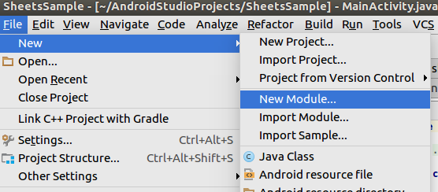
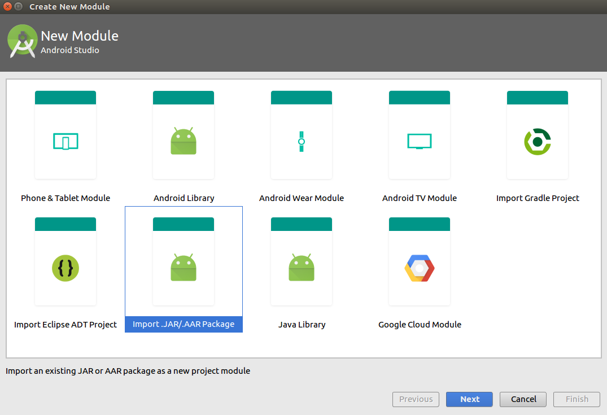
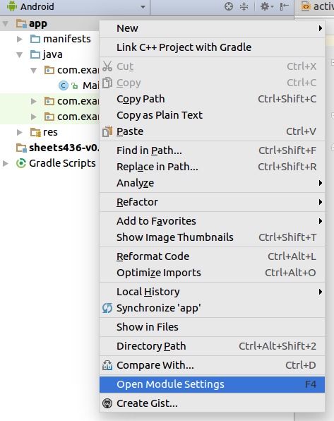
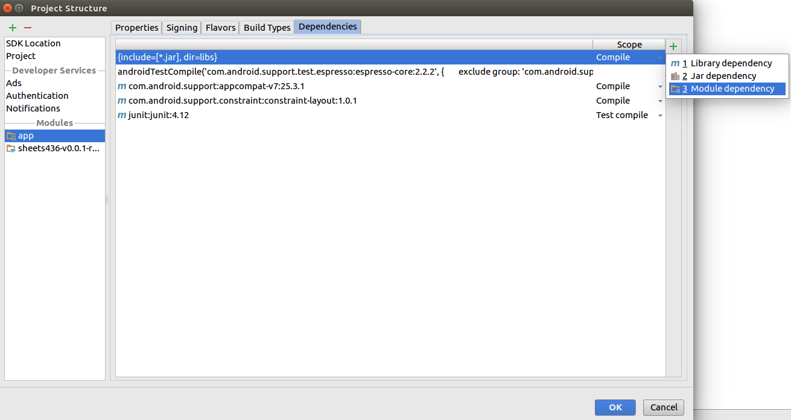

# CMSC436 Google Sheets Common API

This is an Android Library that will allow you to write to the centralized
Google spreadsheet. It will create an Android Archive, or `aar` file (`aar`
files are the Android equivalent of `jar` files) which you can include as a
dependency in your own Android project. Alternatively, you can just copy over
the source code as its own module.

## Pre-Installation

1. Read the [Android Quickstart for Google Sheets][quickstart]. Reread it. Pay
attention to the parts where you'll need to get an API token and a fingerprint.

2. Read about how to [sign your app][signing]. If your release build is not
properly signed, Google will not accept any input you make to Sheets, even if
you previously registered an API token. There will not be any useful warning in
this case. By familiar with all the articles I link. I am not your debugger.

3. Read the tutorial on creating an [Android Library][library]. This will tell
you how to properly import the Sheets code.

## Installation

1. Download the `aar` from the releases or clone this repository. Downloading
the binary is probably easier, though using the source directly as a library
works too (and might work better if you get confused and end up directly pulling
the code into your own `java` file).

2. Import the library as a module. I'll go over importing it as an `aar`, though
importing the source code isn't terribly difficult either. You'll want to go to
`File -> New -> New Module...` and choose `import .JAR/.AAR Package`. This
should make the library part of your app.





Your main module will still need to
list the library as a dependency, so right click on the `app` in the `Android`
view and select `Open Module Settings`. From there, add a `Module Dependency` to
the app.






## Usage

The library is an activity that will send data to Sheets based off the extra
given to it as an intent. Specifically, you want to define `EXTRA_TYPE` to
specifiy the spreadsheet, `EXTRA_USER` to define the patient ID, and
`EXTRA_VALUE` to give the actual value to add to the sheet.

For example, here is a snippet to post data to the left hand tapping test.

```java
import com.example.sheets436.Sheets;

...

private void sendToSheets() {
  Intent sheets = new Intent(this, Sheets.class);
  String myUserId = "t10p01";
  float avg_tapping_time = 72.4f;

  sheets.putExtra(Sheets.EXTRA_TYPE, Sheets.UpdateType.LH_TAP.ordinal());
  sheets.putExtra(Sheets.EXTRA_USER, myUserId);
  sheets.putExtra(Sheets.EXTRA_VALUE, avg_tapping_time);
}
```

The `EXTRA_TYPE` field is an enum that will represent the type of test. If there
are more apps to be implemented in the future, we'll add to this enum.

```java
public enum UpdateType {
  LH_TAP, RH_TAP,
  LH_SPIRAL, RH_SPIRAL,
  LH_LEVEL, RH_LEVEL,
  LH_POP, RH_POP,
  LH_CURL, RH_CURL
}
```

[quickstart]: <https://developers.google.com/sheets/api/quickstart/android>
[signing]: <https://developer.android.com/studio/publish/app-signing.html>
[library]: <https://developer.android.com/studio/projects/android-library.html>
