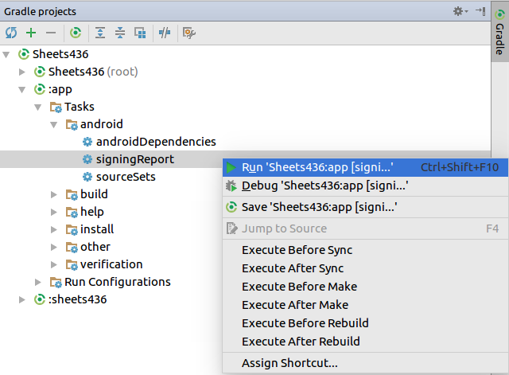
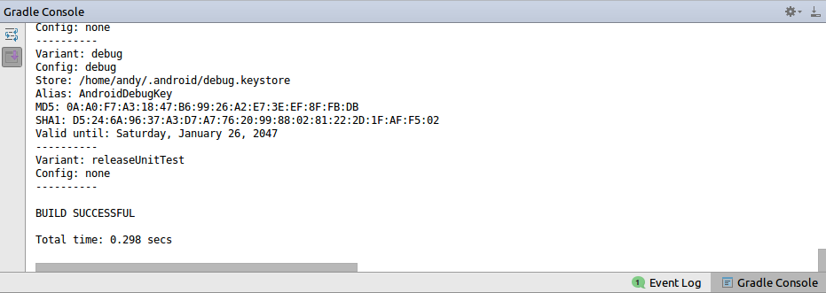

# CMSC436 Google Sheets Common API

This is an Android Library that will allow you to write to the centralized
Google spreadsheet. It will create an Android Archive, or `aar` file (`aar`
files are the Android equivalent of `jar` files) which you can include as a
dependency in your own Android project. Alternatively, you can just copy over
the source code as its own module, though this is not recommended since it will
be harder to pull in centralized changes.

## Useful Readings

1. Read the [Android Quickstart for Google Sheets][quickstart]. Reread it. Pay
attention to the parts where you'll need to get an API token and a fingerprint.

2. Read about how to [sign your app][signing]. This part is optional, but if you
choose to create a release build, you'll have to sign the hash of your release
key.

3. Read the tutorial on creating an [Android Library][library]. This will tell
you how to properly import the Sheets code.

4. Check out the [Google Developer Console][console]. This is where you'll
register any API keys. Depending on how many apps you'll write you may see this
page only once or several times.

## Setting up Authentication

This section goes over the [quickstart][quickstart]. You'll need to have the
Google API Console to accept your app's release or debug key.

1. Get the SHA1 hash of your app's signing key. For your debug key, you can
simply get the hash from the command line.

```bash
keytool -exportcert -alias androiddebugkey -keystore ~/.android/debug.keystore -list -v
```

It should generate an output like this. In this case, the hash you want is
`D5:24:6A:96:37:A3:D7:A7:76:20:99:88:02:81:22:2D:1F:AF:F5:02`.

```
Alias name: androiddebugkey
Creation date: Feb 2, 2017
Entry type: PrivateKeyEntry
Certificate chain length: 1
Certificate[1]:
Owner: C=US, O=Android, CN=Android Debug
Issuer: C=US, O=Android, CN=Android Debug
Serial number: 1
Valid from: Thu Feb 02 21:01:23 EST 2017 until: Sat Jan 26 21:01:23 EST 2047
Certificate fingerprints:
   MD5:  0A:A0:F7:A3:18:47:B6:99:26:A2:E7:3E:EF:8F:FB:DB
   SHA1: D5:24:6A:96:37:A3:D7:A7:76:20:99:88:02:81:22:2D:1F:AF:F5:02
   SHA256: 52:43:FA:66:D1:0F:8F:E8:D4:B0:4C:FD:BD:63:94:81:80:D0:C7:AF:D4:69:2E:5C:AF:CD:D1:5F:DA:76:1C:2D
   Signature algorithm name: SHA1withRSA
   Version: 1
```

If you have multiple signing keys (such as a release key), you can get all the
hashes from the signing from via Android Studio.

In the `Gradle` tab, navigate `:app -> Tasks -> android -> signingReport`. Then
select to run the signing report.



To see the results of the signing report, open up the `Gradle Console`, and you
should see the results of all your signing keys.



Note that you'll probably want to just use `keytool` unless you have multiple
signing keys, or unless you're on Windows.

## Setting up the Build

You'll need to include some Google libraries in your gradle build. The library
adds some additional dependencies, so you'll want to modify your main app's
`build.gradle` to stop the build from breaking. Under the `dependencies` section
of `app/build.gradle`, add the following code.

```
compile 'com.google.android.gms:play-services-auth:10.2.1'
compile('com.google.api-client:google-api-client-android:1.22.0') {
    exclude group: 'org.apache.httpcomponents'
    exclude group: 'com.google.code.findbugs'
}
compile('com.google.apis:google-api-services-sheets:v4-rev466-1.22.0') {
    exclude group: 'org.apache.httpcomponents'
    exclude group: 'com.google.code.findbugs'
}
```

Now it should look something like this.

```
dependencies {
    ...

    compile 'com.google.android.gms:play-services-auth:10.2.1'
    compile('com.google.api-client:google-api-client-android:1.22.0') {
        exclude group: 'org.apache.httpcomponents'
        exclude group: 'com.google.code.findbugs'
    }
    compile('com.google.apis:google-api-services-sheets:v4-rev466-1.22.0') {
        exclude group: 'org.apache.httpcomponents'
        exclude group: 'com.google.code.findbugs'
    }

    ...
}
```

## Importing the Library

1. Download the `aar` from the releases or clone this repository. Downloading
the binary is probably easier, though using the source directly as a library
works too (and might work better if you get confused and end up directly pulling
the code into your own `java` file).

2. Import the library as a module. I'll go over importing it as an `aar`, though
importing the source code isn't terribly difficult either. You'll want to go to
`File -> New -> New Module...` and choose `import .JAR/.AAR Package`. This
should make the library part of your app.


Your main module will still need to
list the library as a dependency, so right click on the `app` in the `Android`
view and select `Open Module Settings`. From there, add a `Module Dependency` to
the app.


## Usage

The library abstracts the logic to write to Google Sheets. You need to provide
the spreadsheet's ID, your user ID, the appropriate test, and the data you'd
like to write. To use the `Sheets` class, you'll need to have your calling
activity implement the `Sheets.Host` interface. In addition, you'll want to
forward the `onRequestPermissionsResult` and `onActivityResult` callbacks.

For example, here is a snippet to post data to the left hand tapping test.

```java
import com.example.sheets436.Sheets;

...

private void sendToSheets() {
  String spreadsheetId = "1ASIF7kZHFFaUNiBndhPKTGYaQgTEbqPNfYO5DVb1Y9Y";
  String userId = "t99p99";
  float data = 1.23f;

  Sheets sheet = new Sheets(this, getString(R.string.app_name), spreadsheetId);
  sheet.writeData(Sheets.TestType.LH_TAP, userId, data);
}
```

The `Sheets.TestType` parameter is an enum that will represent the type of test.
If there are more apps to be implemented in the future, we'll add to this enum.

```java
public enum TestType {
  LH_TAP("'Tapping Test (LH)'"),
  RH_TAP("'Tapping Test (RH)'"),
  LH_SPIRAL("'Spiral Test (LH)'"),
  RH_SPIRAL("'Spiral Test (RH)'"),
  LH_LEVEL("'Level Test (LH)'"),
  RH_LEVEL("'Level Test (RH)'"),
  LH_POP("'Balloon Test (LH)'"),
  RH_POP("'Balloon Test (RH)'"),
  LH_CURL("'Curling Test (LH)'"),
  RH_CURL("'Curling Test (RH)'");

  ...
}
```

### Callbacks

Your activity must implement the `Sheets.Host` interface, which requires you to
implement `getRequestCode` and `notifyFinished`.

```java
public interface Host {

  int getRequestCode(Action action);

  void notifyFinished(Exception e);
}
```

The `getRequestCode` method requires you to define unique request codes for the
four different request actions.

```java
public enum Action {
  REQUEST_PERMISSIONS,
  REQUEST_ACCOUNT_NAME,
  REQUEST_PLAY_SERVICES,
  REQUEST_AUTHORIZATION
}
```

The `notifyFinished` method is a callback that triggers upon the write
finishing. You may use this for your own convenience.

### Additional Overrides

You'll want to override `onRequestPermissionsResult` and `onActivityResult` to
forward the implementation onto the `Sheets` class. Your code should be simple.

```java
@Override
public void onRequestPermissionsResult (int requestCode, @NonNull String permissions[], @NonNull int[] grantResults) {
  this.sheet.onRequestPermissionsResult(requestCode, permissions, grantResults);
}

@Override
protected void onActivityResult(int requestCode, int resultCode, Intent data) {
  super.onActivityResult(requestCode, resultCode, data);
  this.sheet.onActivityResult(requestCode, resultCode, data);
}
```

## Updating the Library

The recommended way of importing this library is as an `aar` file. Therefore,
whenever there are new major changes, we'll release a new version of the `arr`
in the [releases][release] section of this repository. Just download the new
`aar` and follow the same instructions again from the importing section. From
now on, we'll try to make non-breaking changes such that the changes you'll have
to make to your legacy code will either be minimal or nonexistent.

If you choose to import the direct source code of this library as a module, you
will want to keep the source code as a git repo. As a result, you can run
`git pull` to pull in any new changes that happen.

## Contributing

If there are any bugs or unimplemented features that you notice, instead of
being upset, consider pitching in! If you notice anything, you can submit an
[issue][issue] describing the bug/feature. It'll help everybody if it is
well documented.

You can also feel free to contribute code by forking this repository and making
a [pull request][pull]. If you want direct write access, that's an option too.
Just talk to me and I'll add you to this organization.

[quickstart]: <https://developers.google.com/sheets/api/quickstart/android>
[signing]: <https://developer.android.com/studio/publish/app-signing.html>
[library]: <https://developer.android.com/studio/projects/android-library.html>
[console]: <https://console.developers.google.com/apis/credentials>
[release]: <https://github.com/cmsc436/sheets436/releases>
[issue]: <https://github.com/cmsc436/sheets436/issues>
[pull]: <https://github.com/cmsc436/sheets436/pulls>
